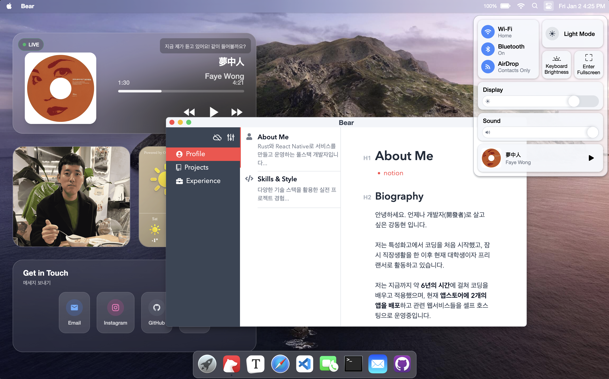
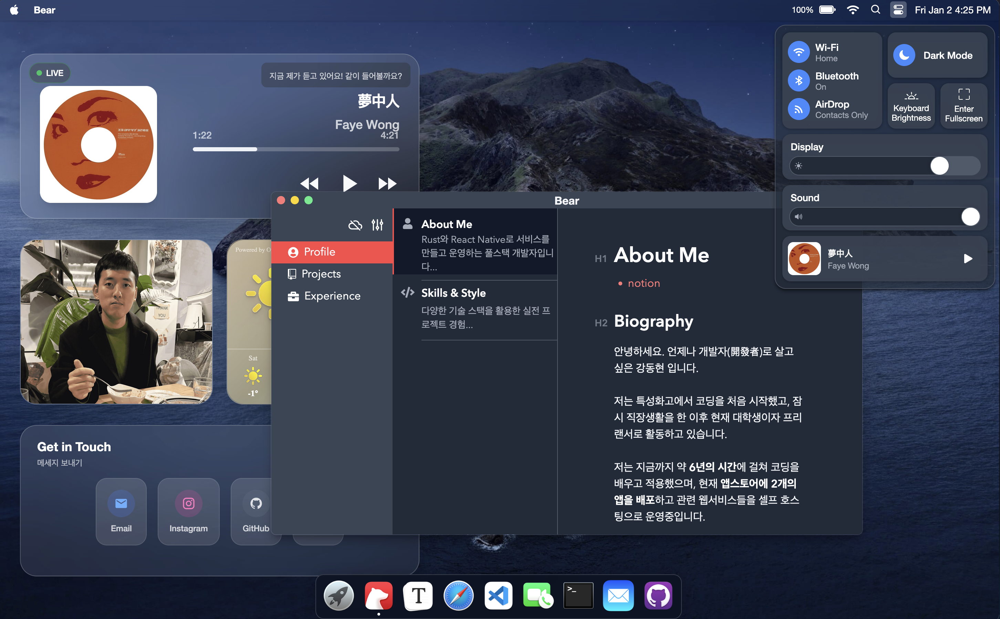

# playground-macos

My portfolio website simulating macOS's GUI: <https://www.kang1027.com>

Powered by [React](https://reactjs.org/) + [Zustand](https://zustand-demo.pmnd.rs/) + [UnoCSS](https://uno.antfu.me/) + [TypeScript](https://www.typescriptlang.org/) + [Vite](https://vitejs.dev/).




&nbsp;

## Features

### macOS Widgets

This project includes custom-built widgets that simulate macOS widget functionality:

- **Live Music**: Real-time Apple Music integration displaying currently playing track
  - Login with admin password (set in `.env.example` as `VITE_ADMIN_PASSWORD`)
  - Connects to Apple Music and syncs playback info via WebSocket
  - Shows album artwork, track details, and playback progress

- **Photos**: Photo gallery widget

- **Weather**: Weather information widget

- **Contact**: Contact form for reaching out

### Contact Form

Implemented a functional contact form that integrates with the backend API.

&nbsp;

## Usage

Clone the repo and install dependencies:

```bash
pnpm install
```

Start dev server (with hot reloading):

```bash
pnpm dev
```

Build for production with minification to the `dist` folder:

```bash
pnpm build
```

&nbsp;

## Backend Integration

This project requires a backend server to enable Live Music and Contact form features.

### Environment Variables

Create a `.env` file based on `.env.example`:

```bash
VITE_API_URL=http://localhost:8000  # Your backend server URL
VITE_ADMIN_PASSWORD=your_password   # Admin password for Apple Music integration
```

### Backend API Specification

The backend should implement the following endpoints:

#### REST API

**1. GET `/api/admin/get-developer-token`**

Get Apple Music developer token

- **Response**: `"string (JWT token)"`

**2. POST `/api/admin/save-token`**

Save user token after Apple Music authentication

- **Request Body**:
  ```json
  {
    "userToken": "string"
  }
  ```
- **Response**: `"Ok"`

**3. POST `/api/contact`**

Submit contact form

- **Request Body**:
  ```json
  {
    "name": "string",
    "email": "string",
    "message": "string"
  }
  ```
- **Response**: `"Ok"`

#### WebSocket API

**WS `/ws/now-playing`**

Real-time music playback information stream

- **Response** (streaming):
  ```json
  {
    "isPlaying": boolean,
    "track": {
      "id": "string",
      "title": "string",
      "artist": "string",
      "album": "string",
      "artwork": "string (URL)",
      "duration": number,
      "currentTime": number,
      "genreNames": ["string"],
      "trackNumber": number,
      "releaseDate": "string",
      "isrc": "string",
      "url": "string",
      "hasLyrics": boolean,
      "previewUrl": "string | null"
    } | null,
    "timestamp": number
  }
  ```

- **Behavior**:
  - Sends cached current playback info immediately upon connection
  - Streams real-time updates whenever playback state changes

### Backend Implementation

You can implement the backend freely. For a reference implementation in Rust (Rocket framework), check out: [https://github.com/kang1027/portfolio_back](https://github.com/kang1027/portfolio_back)

&nbsp;

## Changelog

- **Update 2026.01**: Add macOS-style widgets (Live Music with Apple Music integration, Photos, Weather, Contact) and contact form with backend integration.

- **Update 2023.06.26**: Improve [FaceTime](https://support.apple.com/en-us/HT208176).

- **Update 2023.06.25**: Add [Typora](https://typora.io/), built on top of [Milkdown](https://milkdown.dev/).

- **Update 2021.12.05**: Simulated the device's actual battery state using [Battery API](https://developer.mozilla.org/en-US/docs/Web/API/Battery_Status_API), displaying 100% charge on [unsupported browsers](https://developer.mozilla.org/en-US/docs/Web/API/Battery_Status_API#browser_compatibility).

- **Update 2021.12.05**: Refactored for cleaner code by utilizing functional components and hooks. Refer to [this branch](https://github.com/Renovamen/playground-macos/tree/class-component) for the previous version implemented with class components.

&nbsp;

## Credits

- macOS
  - [Monterey](https://www.apple.com/macos/monterey/)
  - [Catalina](https://www.apple.com/bw/macos/catalina/)
- [macOS Icon Gallery](https://www.macosicongallery.com/)
- [sindresorhus/file-icon-cli](https://github.com/sindresorhus/file-icon-cli)
- [vivek9patel.github.io](https://github.com/vivek9patel/vivek9patel.github.io)

- **Developer:** [kang1027](https://github.com/kang1027) (All core logic, backend, and features)
- **Design Reference:** This project is based on the open-source design by [Xiaohan Zou (@Renovamen)](https://github.com/Renovamen/playground-macos).
- **License:** Distributed under the **MIT License**. See `LICENSE` for more information.
